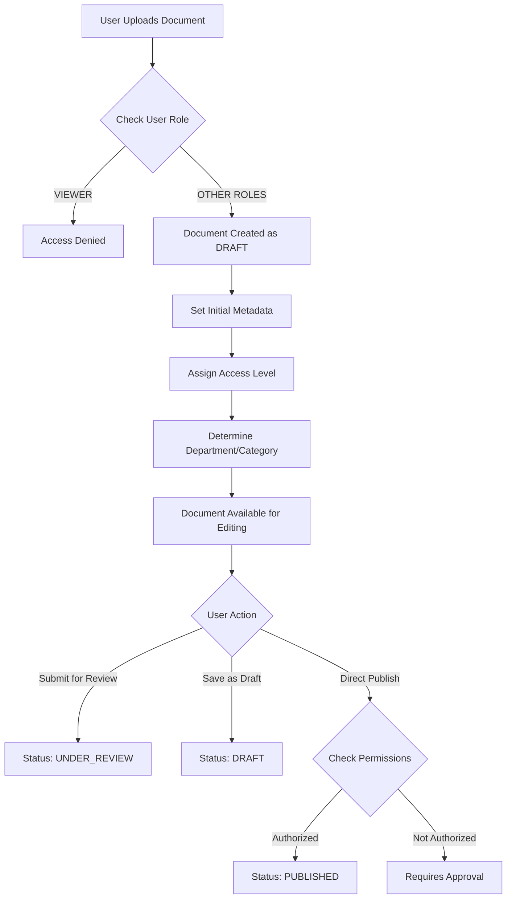
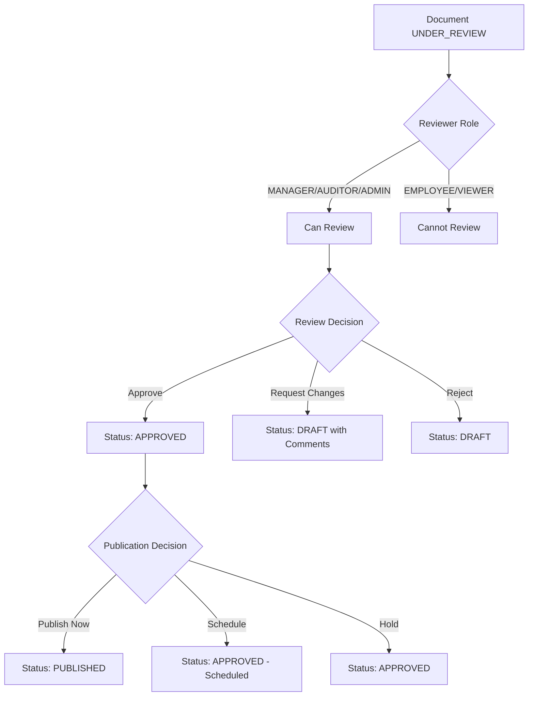
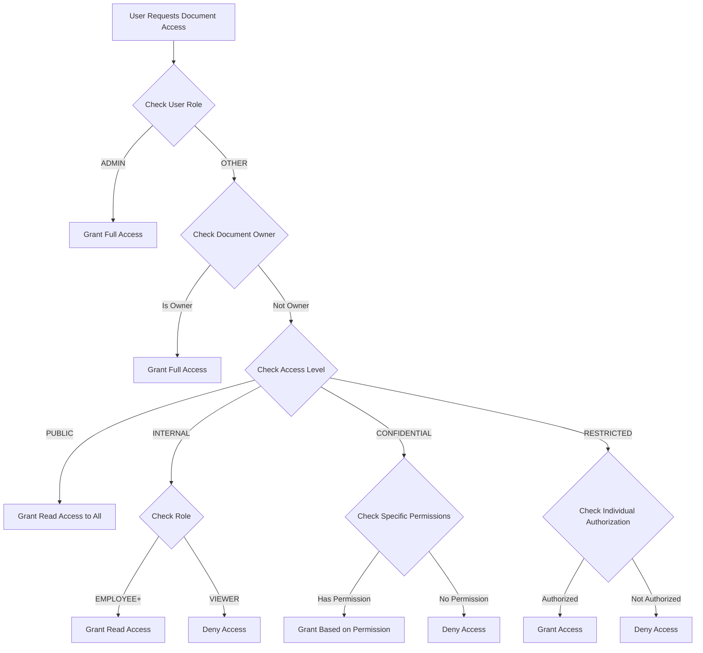

# Document Management Workflow - Complete Documentation

## Table of Contents
1. [System Overview](#system-overview)
2. [User Roles & Permissions](#user-roles--permissions)
3. [Document Lifecycle](#document-lifecycle)
4. [Access Control Levels](#access-control-levels)
5. [Document Categories & Tagging](#document-categories--tagging)
6. [Department-Based Access](#department-based-access)
7. [Detailed Workflow Processes](#detailed-workflow-processes)
8. [Technical Implementation](#technical-implementation)
9. [Audit Trail & Compliance](#audit-trail--compliance)

---

## System Overview

The Comply-X Document Management System is built around **compliance-first principles** with role-based access control, comprehensive audit trails, and structured approval workflows.

### Core Features
- ✅ **Role-based Access Control (RBAC)**
- ✅ **Document Status Lifecycle Management**
- ✅ **Department & Category-based Organization**
- ✅ **Comprehensive Audit Trail**
- ✅ **File Type Support** (PDF, DOC, DOCX, XLS, XLSX, PPT, PPTX, etc.)
- ✅ **Advanced Search & Filtering**
- ✅ **Document Viewing & Editing**
- ✅ **Expiration & Review Management**

---

## User Roles & Permissions

### 1. **ADMIN** 🔴
**Highest level access - Full system control**

| Permission | Create | Read | Edit | Delete | Approve | Download | Special |
|------------|--------|------|------|--------|---------|----------|---------|
| **Documents** | ✅ | ✅ | ✅ | ✅ | ✅ | ✅ | Can access ALL documents regardless of access level |
| **Users** | ✅ | ✅ | ✅ | ✅ | ✅ | - | Manage user roles & permissions |
| **System** | ✅ | ✅ | ✅ | ✅ | ✅ | ✅ | System configuration & settings |

**Typical Users:** IT Administrators, Compliance Officers, System Managers

### 2. **MANAGER** 🟠
**Departmental management and oversight**

| Permission | Create | Read | Edit | Delete | Approve | Download | Special |
|------------|--------|------|------|--------|---------|----------|---------|
| **Documents** | ✅ | ✅ | ✅ | ✅ | ✅ | ✅ | Can approve documents in their department |
| **Team Documents** | ✅ | ✅ | ✅ | ✅ | ✅ | ✅ | Full access to department documents |
| **Public/Internal** | ✅ | ✅ | ✅ | ❌ | ❌ | ✅ | Limited delete/approve for non-dept docs |

**Typical Users:** Department Heads, Team Leads, Project Managers

### 3. **AUDITOR** 🟡
**Compliance review and audit functions**

| Permission | Create | Read | Edit | Delete | Approve | Download | Special |
|------------|--------|------|------|--------|---------|----------|---------|
| **Documents** | ✅ | ✅ | ✅ | ❌ | ✅ | ✅ | Focus on compliance review |
| **Audit Trail** | ❌ | ✅ | ❌ | ❌ | ❌ | ✅ | Can access all audit logs |
| **Reports** | ✅ | ✅ | ✅ | ❌ | ✅ | ✅ | Generate compliance reports |

**Typical Users:** Internal Auditors, Compliance Specialists, Quality Managers

### 4. **EMPLOYEE** 🟢
**Standard user access for regular operations**

| Permission | Create | Read | Edit | Delete | Approve | Download | Special |
|------------|--------|------|------|--------|---------|----------|---------|
| **Own Documents** | ✅ | ✅ | ✅ | ✅ | ❌ | ✅ | Full control of created documents |
| **Public Documents** | ❌ | ✅ | ❌ | ❌ | ❌ | ✅ | Read-only access |
| **Internal Documents** | ❌ | ✅ | ❌ | ❌ | ❌ | ✅ | Read-only access |
| **Department Docs** | ✅ | ✅ | ✅* | ❌ | ❌ | ✅ | *Edit only if granted specific access |

**Typical Users:** Regular Staff, Contributors, Department Members

### 5. **VIEWER** 🔵
**Read-only access for external stakeholders**

| Permission | Create | Read | Edit | Delete | Approve | Download | Special |
|------------|--------|------|------|--------|---------|----------|---------|
| **Public Documents** | ❌ | ✅ | ❌ | ❌ | ❌ | ✅ | Only public documents |
| **Granted Access** | ❌ | ✅ | ❌ | ❌ | ❌ | ✅ | Only specifically granted documents |

**Typical Users:** External Consultants, Contractors, Read-only Stakeholders

---

## Document Lifecycle

### Status Flow Diagram
```
[DRAFT] → [UNDER_REVIEW] → [APPROVED] → [PUBLISHED]
   ↓           ↓              ↓            ↓
[ARCHIVED] ←←←←←←←←←←←←←←←←←←←←←←←←←←←←←←←← [EXPIRED]
```

### 1. **DRAFT** 📝
- **Purpose:** Initial document creation and preparation
- **Who can create:** All roles except VIEWER
- **Who can edit:** Document owner, ADMIN, MANAGER (if same dept)
- **Visibility:** Only creator and authorized reviewers
- **Actions Available:**
  - Edit content and metadata
  - Submit for review
  - Delete (by owner/admin)
  - Add collaborators

### 2. **UNDER_REVIEW** ⏳
- **Purpose:** Document is being reviewed by supervisors
- **Who can approve:** MANAGER, AUDITOR, ADMIN
- **Who can edit:** Document owner (with restrictions), ADMIN
- **Visibility:** Reviewers, owner, and authorized users
- **Actions Available:**
  - Add review comments
  - Request changes
  - Approve or reject
  - Return to draft

### 3. **APPROVED** ✅
- **Purpose:** Document approved but not yet live
- **Who can publish:** MANAGER, ADMIN
- **Who can edit:** ADMIN only (or return to draft)
- **Visibility:** Approvers and authorized users
- **Actions Available:**
  - Schedule publication
  - Final review
  - Publish immediately
  - Return to review

### 4. **PUBLISHED** 🌐
- **Purpose:** Document is live and accessible
- **Who can access:** Based on access level and permissions
- **Who can edit:** ADMIN, MANAGER (creates new version)
- **Visibility:** According to access level rules
- **Actions Available:**
  - View and download
  - Create new version
  - Schedule review
  - Archive

### 5. **ARCHIVED** 📦
- **Purpose:** Document no longer active but kept for records
- **Who can access:** ADMIN, AUDITOR, original creator
- **Who can restore:** ADMIN, MANAGER
- **Visibility:** Limited to authorized roles
- **Actions Available:**
  - View for reference
  - Restore if needed
  - Permanent deletion (ADMIN only)

### 6. **EXPIRED** ⚠️
- **Purpose:** Document past expiration date
- **Who can update:** ADMIN, MANAGER, document owner
- **Visibility:** Same as published but with warnings
- **Actions Available:**
  - Review and update
  - Extend validity period
  - Archive
  - Create replacement

---

## Access Control Levels

### 1. **PUBLIC** 🌍
- **Who can access:** Everyone in the organization
- **Who can view:** All user roles
- **Who can download:** All user roles
- **Examples:** Company policies, announcements, general procedures
- **Use cases:** Information that should be available to all employees

### 2. **INTERNAL** 🏢
- **Who can access:** ADMIN, MANAGER, AUDITOR, EMPLOYEE
- **Who can view:** All roles except VIEWER
- **Who can download:** All roles except VIEWER
- **Examples:** Internal procedures, department guidelines, training materials
- **Use cases:** Standard business documents for employees

### 3. **CONFIDENTIAL** 🔒
- **Who can access:** ADMIN, specific roles/departments with granted access
- **Who can view:** Explicitly authorized users only
- **Who can download:** Explicitly authorized users only
- **Examples:** HR policies, financial documents, legal contracts
- **Use cases:** Sensitive business information

### 4. **RESTRICTED** 🚫
- **Who can access:** ADMIN, specifically authorized individuals
- **Who can view:** Named users only
- **Who can download:** Named users only
- **Examples:** Executive documents, board materials, legal settlements
- **Use cases:** Highly sensitive or classified information

---

## Document Categories & Tagging

### Pre-defined Categories

#### 1. **Policy Documents**
- **Department:** All Departments
- **Examples:** Code of Conduct, Information Security Policy, Data Protection Policy
- **Typical Access:** PUBLIC or INTERNAL
- **Review Cycle:** Annually

#### 2. **Procedure Documents**
- **Department:** Specific to department
- **Examples:** Incident Response Procedure, Onboarding Process, Quality Control Steps
- **Typical Access:** INTERNAL or CONFIDENTIAL
- **Review Cycle:** Bi-annually

#### 3. **Form Templates**
- **Department:** Various
- **Examples:** Expense Forms, Leave Applications, Risk Assessment Forms
- **Typical Access:** INTERNAL
- **Review Cycle:** As needed

#### 4. **Training Materials**
- **Department:** HR, specific departments
- **Examples:** Compliance Training, Safety Procedures, Technical Documentation
- **Typical Access:** INTERNAL
- **Review Cycle:** Annually

#### 5. **Audit Reports**
- **Department:** Audit, Finance
- **Examples:** Internal Audit Reports, Compliance Assessments, Risk Evaluations
- **Typical Access:** CONFIDENTIAL or RESTRICTED
- **Review Cycle:** As required by regulations

#### 6. **Incident Reports**
- **Department:** Security, Operations
- **Examples:** Security Incidents, System Outages, Safety Reports
- **Typical Access:** CONFIDENTIAL
- **Review Cycle:** Quarterly review

### Custom Tagging System

#### Tags for Organization:
- **#urgent** - Requires immediate attention
- **#regulatory** - Required by regulations
- **#gdpr** - GDPR compliance related
- **#iso27001** - ISO 27001 standard related
- **#sox** - Sarbanes-Oxley compliance
- **#annual-review** - Requires yearly review
- **#quarterly-review** - Requires quarterly review

#### Tags for Functionality:
- **#template** - Document template for reuse
- **#checklist** - Process checklist
- **#reference** - Reference document
- **#procedure** - Step-by-step procedure
- **#guideline** - Best practice guideline

---

## Department-Based Access

### How Department Access Works

#### 1. **User Department Assignment**
```json
{
  "user_id": 123,
  "department": "HR",
  "position": "HR Manager",
  "areas_of_responsibility": ["recruitment", "employee_relations", "compliance"]
}
```

#### 2. **Document Department Tagging**
```json
{
  "document_id": 456,
  "category": "HR Policies",
  "subcategory": "Employee Handbook",
  "department_tags": ["HR", "Legal"],
  "access_level": "INTERNAL"
}
```

#### 3. **Access Rule Examples**

**Scenario 1: HR Employee accessing HR Document**
```
User: John Doe (EMPLOYEE, HR Department)
Document: Employee Handbook (INTERNAL, HR Department)
Result: ✅ GRANTED - Same department, internal access level
```

**Scenario 2: IT Employee accessing HR Document**
```
User: Jane Smith (EMPLOYEE, IT Department)  
Document: Employee Handbook (INTERNAL, HR Department)
Result: ✅ GRANTED - Internal documents accessible to all employees
```

**Scenario 3: External Contractor accessing Confidential Document**
```
User: Bob Wilson (VIEWER, External)
Document: Salary Guidelines (CONFIDENTIAL, HR Department)
Result: ❌ DENIED - Insufficient access level
```

### Department Structure Examples

#### 1. **Human Resources (HR)**
- **Document Types:** Policies, Procedures, Forms, Training
- **Common Access Levels:** INTERNAL, CONFIDENTIAL
- **Special Permissions:** 
  - HR Managers can access all HR documents
  - HR Employees can access non-confidential HR documents
  - Other departments can access PUBLIC HR documents

#### 2. **Information Technology (IT)**
- **Document Types:** Technical Procedures, Security Policies, System Documentation
- **Common Access Levels:** INTERNAL, CONFIDENTIAL, RESTRICTED
- **Special Permissions:**
  - IT Admins have elevated access to technical documents
  - Security-related documents may be RESTRICTED

#### 3. **Finance**
- **Document Types:** Financial Procedures, Audit Reports, Compliance Documents
- **Common Access Levels:** CONFIDENTIAL, RESTRICTED
- **Special Permissions:**
  - Finance Managers have full access
  - Auditors have read access to all finance documents

#### 4. **Legal**
- **Document Types:** Contracts, Legal Procedures, Compliance Frameworks
- **Common Access Levels:** CONFIDENTIAL, RESTRICTED
- **Special Permissions:**
  - Legal team has full access
  - Other departments have limited access based on need

---

## Detailed Workflow Processes

### 1. Document Creation Workflow



### 2. Document Review & Approval Workflow



### 3. Document Access Control Workflow



---

## Technical Implementation

### Database Schema Key Tables

#### 1. **users** Table
```sql
- id (Primary Key)
- email, username, first_name, last_name
- role (ADMIN, MANAGER, AUDITOR, EMPLOYEE, VIEWER)
- department (HR, IT, Finance, Legal, etc.)
- position, areas_of_responsibility
- is_active, is_verified
```

#### 2. **documents** Table
```sql
- id (Primary Key)
- title, description, document_type
- status (DRAFT, UNDER_REVIEW, APPROVED, PUBLISHED, ARCHIVED, EXPIRED)
- access_level (PUBLIC, INTERNAL, CONFIDENTIAL, RESTRICTED)
- category, subcategory, keywords, tags
- file_path, file_size, mime_type, file_hash
- created_by_id, modified_by_id, approved_by_id
- created_at, updated_at, approved_at, published_at
- expires_at, next_review_date
```

#### 3. **document_access** Table
```sql
- id (Primary Key)
- document_id (Foreign Key)
- user_id (Optional - for individual access)
- role (Optional - for role-based access)
- department (Optional - for department-based access)
- can_read, can_download, can_edit, can_delete, can_approve
- granted_by_id, granted_at, expires_at
```

#### 4. **document_audit_logs** Table
```sql
- id (Primary Key)
- document_id, user_id
- action (CREATE, READ, UPDATE, DELETE, DOWNLOAD, APPROVE)
- details (JSON with additional information)
- ip_address, user_agent, timestamp
```

### API Endpoints

#### Document Operations
- `POST /api/documents/upload` - Upload new document
- `GET /api/documents/search` - Search and filter documents  
- `GET /api/documents/{id}` - Get document details
- `GET /api/documents/{id}/download` - Download document
- `PUT /api/documents/{id}` - Update document metadata
- `DELETE /api/documents/{id}` - Delete document

#### Access Control
- `POST /api/documents/{id}/access` - Grant/modify access
- `GET /api/documents/{id}/access` - List access permissions
- `DELETE /api/documents/{id}/access/{access_id}` - Remove access

#### Workflow
- `POST /api/documents/{id}/submit-review` - Submit for review
- `POST /api/documents/{id}/approve` - Approve document
- `POST /api/documents/{id}/publish` - Publish document
- `POST /api/documents/{id}/archive` - Archive document

---

## Audit Trail & Compliance

### Tracked Actions

#### 1. **Document Actions**
- **CREATE** - Document upload/creation
- **READ** - Document view/access
- **UPDATE** - Metadata or content changes
- **DELETE** - Document deletion
- **DOWNLOAD** - File download
- **APPROVE** - Document approval
- **PUBLISH** - Document publication
- **ARCHIVE** - Document archiving

#### 2. **Access Actions**
- **GRANT_ACCESS** - Access permission granted
- **REVOKE_ACCESS** - Access permission revoked
- **ACCESS_DENIED** - Access attempt blocked

#### 3. **System Actions**
- **LOGIN** - User system login
- **LOGOUT** - User system logout
- **PERMISSION_CHANGE** - Role/permission modification

### Audit Log Details

Each audit entry includes:
```json
{
  "id": 12345,
  "document_id": 456,
  "user_id": 123,
  "action": "DOWNLOAD",
  "details": {
    "filename": "employee_handbook.pdf",
    "file_size": 2048576,
    "access_level": "INTERNAL",
    "department": "HR"
  },
  "ip_address": "192.168.1.100",
  "user_agent": "Mozilla/5.0 (Windows NT 10.0; Win64; x64)...",
  "timestamp": "2024-01-15T10:30:00Z"
}
```

### Compliance Reports

#### 1. **Access Reports**
- Who accessed what documents when
- Failed access attempts
- Permission changes over time

#### 2. **Document Lifecycle Reports**
- Document status changes
- Approval workflows
- Review cycles and compliance

#### 3. **User Activity Reports**
- User login/logout patterns
- Document interaction history
- Permission escalations

### Data Retention & Privacy

#### Document Retention Policies
- **Active Documents:** Kept indefinitely while published
- **Archived Documents:** Retained for 7 years (configurable)
- **Audit Logs:** Retained for 10 years (compliance requirement)
- **User Data:** Retained per privacy policy/GDPR requirements

#### Privacy Controls
- **Data Minimization:** Only collect necessary metadata
- **Right to Access:** Users can request their data
- **Right to Delete:** GDPR deletion requests (with compliance exceptions)
- **Data Portability:** Export capabilities for user data

---

## Example Use Cases

### Use Case 1: HR Policy Update

**Scenario:** HR needs to update the Employee Handbook

**Workflow:**
1. **HR Manager** (MANAGER role) uploads new version
2. Document created as **DRAFT** status
3. Document tagged with **HR department** and **INTERNAL** access
4. HR Manager edits content and submits for **UNDER_REVIEW**
5. **Compliance Auditor** (AUDITOR role) reviews and approves
6. Document status changes to **APPROVED**
7. HR Manager publishes document → status **PUBLISHED**
8. All employees (INTERNAL access) can now view/download
9. Previous version automatically archived

**Permissions:**
- HR Employees: Read/Download
- Other Employees: Read/Download  
- Managers: Read/Download/Edit (if granted)
- Viewers: No access

### Use Case 2: IT Security Incident Report

**Scenario:** Security team documents a data breach incident

**Workflow:**
1. **Security Analyst** (EMPLOYEE role, IT dept) creates incident report
2. Document created as **DRAFT** with **CONFIDENTIAL** access level
3. Only IT department and management can access
4. **IT Manager** reviews and submits to **UNDER_REVIEW**
5. **Compliance Auditor** and **Legal** review the document
6. After approval, status changes to **PUBLISHED** but remains **CONFIDENTIAL**
7. Access limited to IT, Legal, Executive team
8. Document scheduled for quarterly review

**Permissions:**
- IT Department: Read/Download
- Legal Department: Read/Download
- Executives (MANAGER+): Read/Download
- Other Employees: No access
- External Viewers: No access

### Use Case 3: Department-Specific Training Material

**Scenario:** Finance department creates expense reporting training

**Workflow:**
1. **Finance Manager** uploads training materials
2. Documents tagged with **Finance department** and **Training** category
3. Access level set to **INTERNAL** - all employees can access
4. Finance-specific sections marked as **CONFIDENTIAL** for Finance dept only
5. Training completion tracked via audit logs
6. Document set to expire after 1 year for content refresh

**Permissions:**
- All Employees: Access to general sections
- Finance Department: Access to all sections including confidential
- Managers: Full access for oversight
- External Viewers: No access

---

## Security Considerations

### File Security
- **Virus Scanning:** All uploads scanned for malware
- **File Type Validation:** Only approved file types allowed
- **Size Limits:** Maximum file size enforced (100MB default)
- **Hash Verification:** SHA-256 hash calculated for integrity

### Access Security
- **Token-based Authentication:** JWT tokens for API access
- **Role-based Authorization:** Permissions checked on every request
- **IP Tracking:** All access attempts logged with IP address
- **Session Management:** Secure session handling

### Data Security
- **Encryption at Rest:** Documents encrypted on disk
- **Encryption in Transit:** HTTPS/TLS for all communications
- **Secure File Storage:** Protected file system location
- **Backup Encryption:** Encrypted backups with secure key management

---

This documentation provides a comprehensive overview of the document management workflow. The system ensures compliance, security, and proper access control while maintaining an audit trail for all activities.